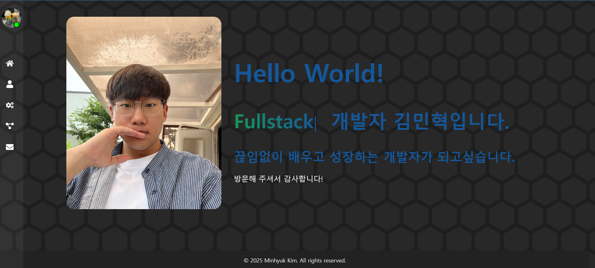

# Project 7 - React Portfolio



## 🧭 프로젝트 소개

React + Vite 기반으로 제작된 프론트엔트 포트폴리오 웹사이트 입니다. 그리드를 레이아웃을 활용하여 깔끔한 UI를 구성했으며, 방문자가 개발자의 이력, 기술스택, 프로젝트들을 직관적으로 확인할 수 있도록 설계되었습니다.

- React + Vite 기반 빌드 환경
- React Router를 통한 페이지 라우팅 구성
- styled-components 및 react-icons 등 다양한 라이브러리 활용
- uiverse.io의 UI 컴포넌트를 커스터마이징하여 사용
- 반응형 웹 구현

---

## 💡 제작 동기

대학교 졸업 후 포트폴리오가 없는 상태에서, 개발자 교육을 받으며 진행했던 프로젝트들을 기록하고자 제작하게 되었습니다. React 수업에서 배운 내용을 실습하며, 학습한 기술들을 정리하고 취업 활동에 활용하기 위한 목적으로 만들었습니다.

---

## 📦 프로젝트 구조

(파일이 많아 간소화하여 작성하였습니다.)

```
src/
├── assets/                           // 이미지 리소스
├── components/                       
│   ├── data/                         // 프로젝트 카드 데이터
│   ├── nav/                          // 네비게이션 컴포넌트
│   └── ...tsx                        // 기타 컴포넌트
├── layout/                           // header, footer 등 레이아웃 관련 구성
├── pages/                            // Home, AboutMe, Skills, Projects, Contact 페이지
├── styles/                           // 각 페이지별 css module
└── type/                             // chrono 라이브러리에 대한 타입 선언 파일
```

---

## 🗓️ 제작 기간

- **2025.05.22 ~ 2025.05.28 (총 7일)**

---

## 🧑 제작 인원

- 개인 프로젝트 (1인 개발)

---

## 🗂️ 페이지 구성

- **Home**: 메인 화면 (인트로 이미지와 한 줄 소개)
- **About Me**: 이름, 생년월일, 위치 정보, 자기소개 및 연혁 타임라인
- **Skills**: Frontend / Backend / Tools & DB 기술을 토글 방식으로 정리
- **Projects**: 주요 프로젝트를 카드 형태로 소개
- **Contact**: GitHub 및 이메일 등 연락처 정보 제공

---

## 🧑‍💻 사용 기술

- **Frontend**: React, TypeScript (.tsx), Vite
- **Styling**: styled-components, css module
- **라우팅**: react-router-dom
- **아이콘**: react-icons
- **타임라인**: react-chrono
- **UI**: uiverse.io 컴포넌트 기반 수정 및 적용
- **배포**: Vercel

---

## 🔮 향후 추가 가능 기능

- 📩 Contact 섹션에 폼을 추가해 실시간 메일 전송 기능
- 🌐 다국어 포트폴리오 지원 (영어 & 일본어)
- 🌙 다크 모드 / 라이트 모드 토글 기능
- 📋 최근 번역 내역 저장 및 불러오기 기능
- 🔍 프로젝트 검색 및 필터 기능

---

## 🧑‍💻 개발 중 겪은 문제 및 해결 방식

- 모니터 해상도에 따라 콘텐츠 레이아웃 구조가 왼쪽으로 쏠리는 현상
    
    → 아직 해결 중 `@media` 로 모바일&태블릿 환경뿐만 아니라 QHD등과 같은 환경에서도 반응형이 필요할 것으로 보임. 또는 `clamp()` 를 사용해 볼 계획중. (해결 후 수정 예정)
    
- uiverse.io Typewriter 애니메이션이 여러 단어 사용 시 비정상 작동
    
    → 단어 배열을 `useState`로 관리하고, `useEffect` 및 조건문을 추가하여 순차적으로 출력되도록 개선
    
- `react-chrono` 라이브러리 사용 시 ‘선언 파일을 찾을 수 없다’는 오류 발생
    
    → `react-chrono` 는 자바스크립트 라이브러리이므로 타입 선언이 포함되어 있지 않아 `src` 폴더 하위에 `types` 폴더 생성 후에 하단과 같이 작성하여 따로 선언
    
    ```tsx
    declare module 'react-chrono' {
      const content: any;
      export = content;
    }
    ```
    
    - 이후, `tsconfig.json` 에 타입 경로 추가를 위해 하단과 같이 작성해서 추가해서 해결
        
        ```tsx
          "compilerOptions": {
            "typeRoots": ["./node_modules/@types", "./src/types"]
          },
        ```
        
- `react-chrono` 라이브러리 적용 시 타임라인에 툴바 자동 생성
    
    → 라이브러리 웹사이트에서 항목을 찾아본 뒤 `disableToolbar={true}` 속성 부여하여 툴바 제거 완료
    
- Vercel 배포 후 페이지 라우팅 시 404 에러 발생
    
    → 프로젝트 루트에 `vercel.json` 파일 추가하여 해결
    
    ```json
    {
      "rewrites": [
        { "source": "/(.*)", "destination": "/" }
      ]
    }
    ```
    
- 일부 이미지가 Github에 푸시 후에도 Vercel에서 정상 표시되지 않음
    
    → `import` 를 통해 이미지 경로를 불러옴으로 해결
    
    ```tsx
    import projectImg from "../assets/1.jpg";
    ```